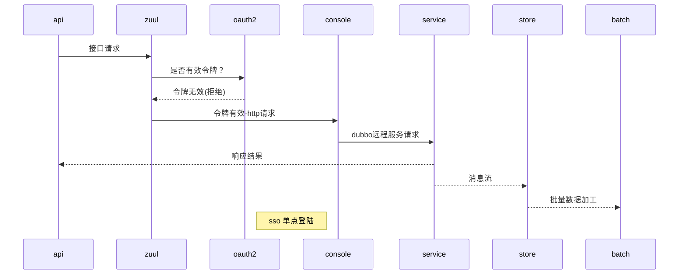
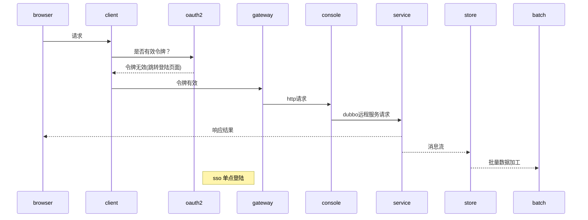

# bpay-project

>## spring boot/cloud
#### 1.dubbo for service and console.
#### 2.eureka for console and client with eureka.
#### 3.Hystrix for client

>## db
#### 1.mysql relation db for service.
#### 2.mongodb document store for store.
#### 3.redis\hezalcast key/value for service.

>## Messaging
#### 1. kafka for store with service.

>## Cloud Routing
#### 1.Spring Cloud Gateway(NIO)
#### 2.zuul

>## OAuth2
#### 1.OAuth2 for sso-provider 
#### 2.client for sso-client
#### 3.zuul for sso-resource

>## batch+quartz
#### 1. bpay-batch for batch job.

## 架构图
> URL API方式

> browser 方式

2018/11/3