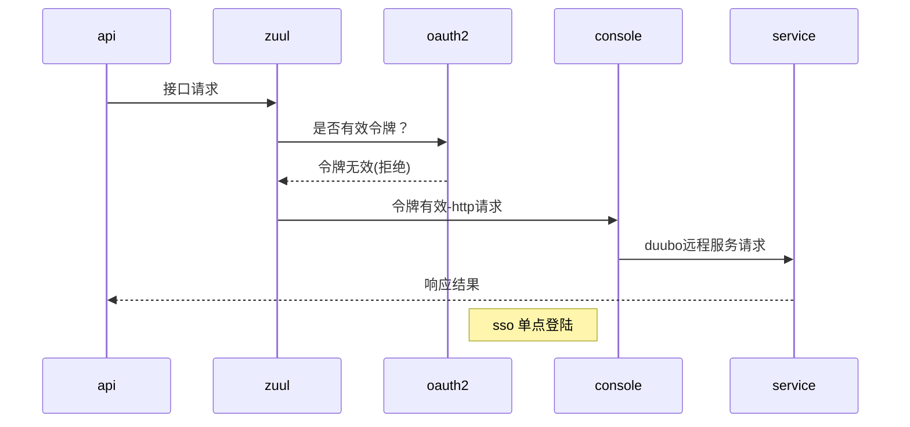
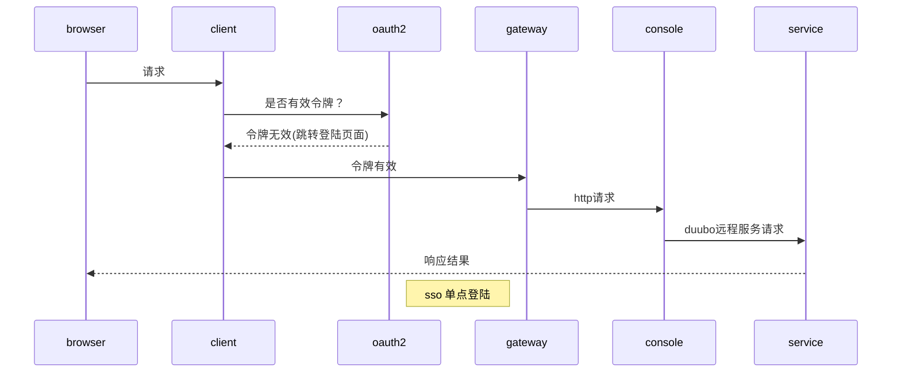
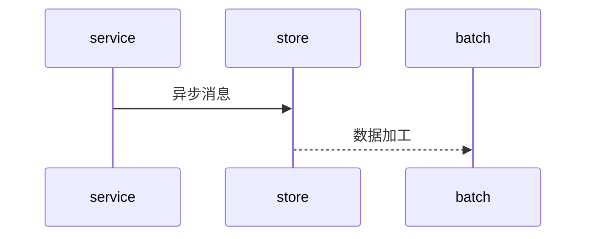

## 架构图

> URL API方式

```mermaid
sequenceDiagram
api ->> zuul: 接口请求
zuul ->> oauth2: 是否有效令牌？
oauth2 -->> zuul: 令牌无效(拒绝)
zuul ->> console: 令牌有效-http请求
console ->> service: duubo远程服务请求
service -->> api: 响应结果
Note right of oauth2: sso 单点登陆
```
> browser 方式

```mermaid
sequenceDiagram
browser ->> client: 请求
client ->> oauth2: 是否有效令牌？
oauth2 -->> client: 令牌无效(跳转登陆页面)
client ->> gateway: 令牌有效
gateway ->> console: http请求
console ->> service: duubo远程服务请求
service -->> browser: 响应结果
Note right of oauth2: sso 单点登陆
```
> 批量服务

```mermaid
sequenceDiagram
service ->> store: 异步消息
store -->> batch: 数据加工
```
